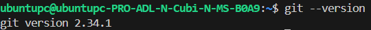

# 3. Install Git on Windows through Visual Studio Code

Git is an open source version control application. You will need Git installed for this class.

You may already have Git installed so let's check! Open Terminal if you are on a Mac, Linux, or PowerShell if you are on a
Windows machine, and type:

```
$ git --version
```

You should see something like this:

```
$ git --version
git version 2.11.0
```



Anything over 2.0 will work for this class!

If you don't already have Git installed, you can download Git at www.git-scm.com. If you need additional assistance installing Git, you can find more information in the ProGit chapter on installing Git:

```
http://git-scm.com/book/en/v2/Getting-Started-Installing-Git .
```

Now is a good time to create a shortcut to the command line application you will want to use with Git:
- If you are working on Windows, we recommend Git Bash which is installed with the Git package, so that you can
follow along with the facilitator who will be using Bash.
- If you are working on a Mac or other Unix-based system, you can use the built-in Terminal application