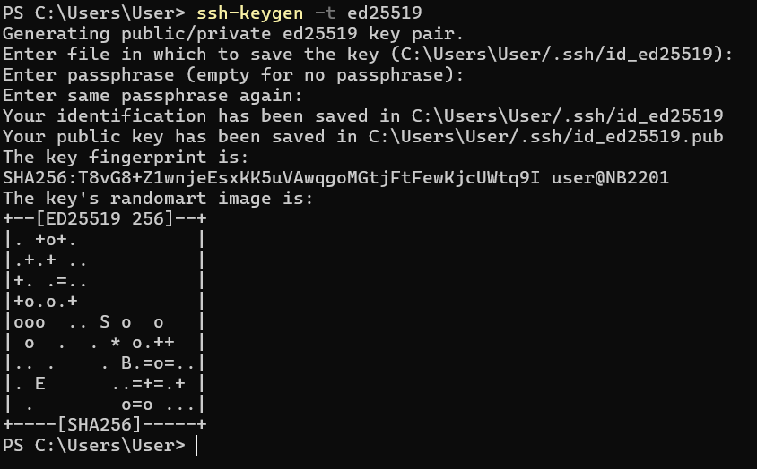

# 5. SSH keys

SSH allows authentication between two hosts without the need of a password. SSH key authentication uses a **private key** and a **public key**.

To generate the keys, run the following command:

`ssh-keygen -t ed25519`

You can also add comment to the key.
`ssh-keygen -t ed25519 -C "renesas-ssh-key`

