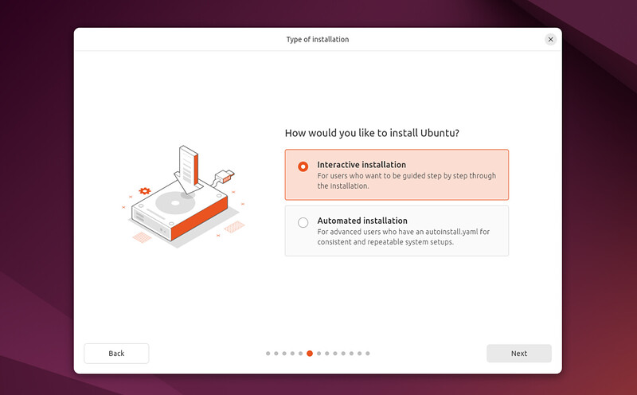
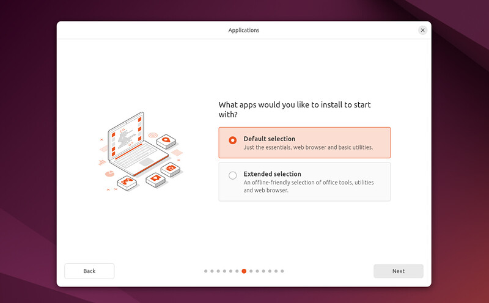
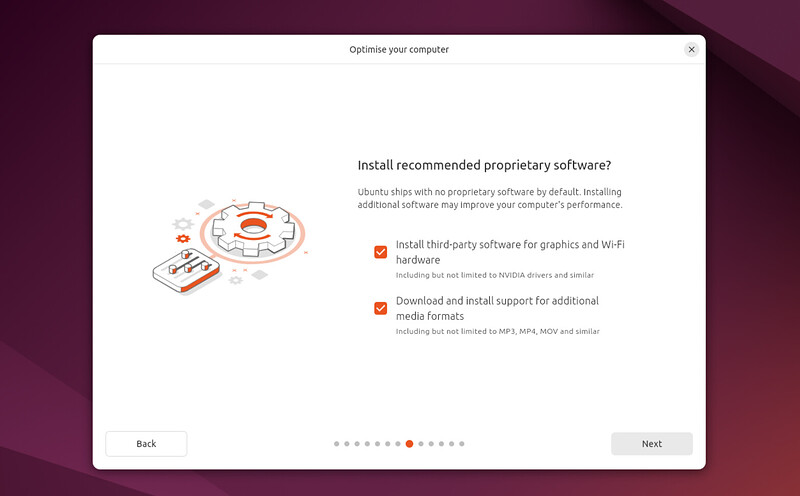

# 5. Installation Setup

You will be prompted to choose between **Interactive installation** and **Automated Installation**. The interactive option is the standard route, but more advanced users can use the automated installation option to import a configuration file from a web server to standardise multiple installs and add further customisations. An example tutorial for Automated installation is available here.

In this tutorial we will remain on the primary route.

You will be prompted to choose between the **Default selection** and **Extended selection** options. The default installation comes with the basic essentials to get started which you can then expand on after install using the App Center. The extended selection contains additional office tools and utilities, useful for offline situations.

In the following screen you will be prompted to install third-party software that may improve device support and performance (for example, Nvidia graphics drivers) and support for additional media formats. It is recommended to check both of these boxes.
